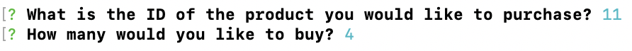
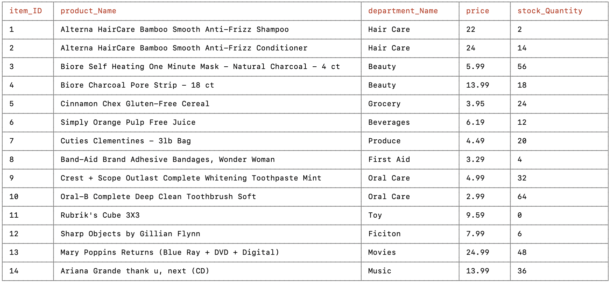
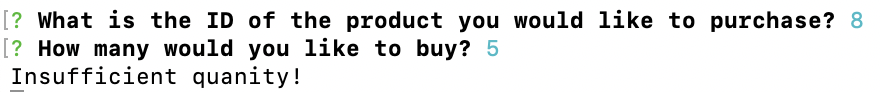
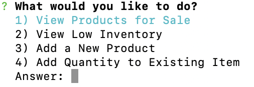
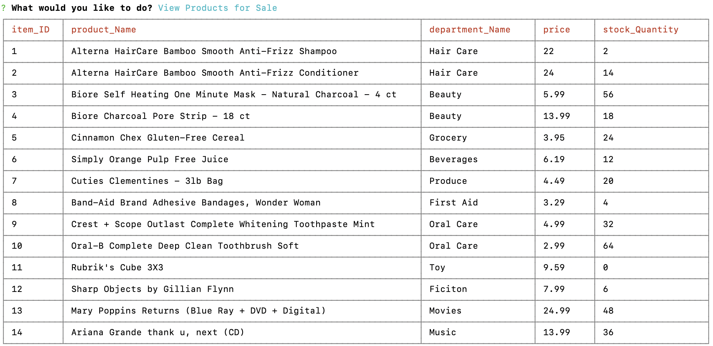
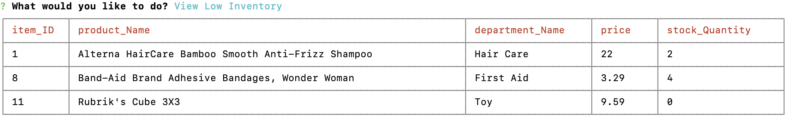
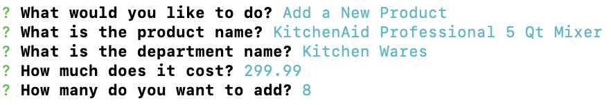
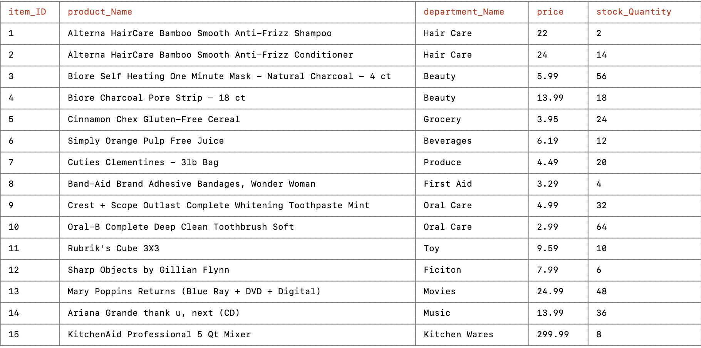
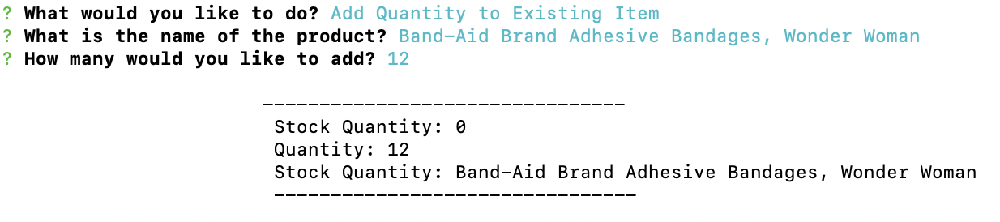
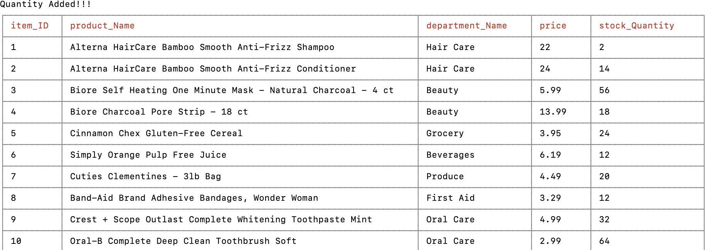

# bamazon

### About BAMazon:

This app gives the user the option to purchase from the amazing BAMazon store or the manager the option to view products for sale, to view products that are low in stock quantity, to add new products, or to add stock to an existing product.  A table displays, consisting of an item ID, product name, department name, price, and stock quantity.

### What Packages Are Used:
* MySQL
* Inquirer
* CLI-Table

### How It Works:

1. Clone repository to your computer.
2. Peform npm install in your terminal.
3. Run node bamazonCustomer.js  or bamazonManager.js in your terminal.

### The Customer Application:

This is the Table that first appears for the user:

These are the prompts the User must answer:

Once the the customer has placed an order, the table updates with the new amounts of stock quantity:

or the message "Insufficient quantity!" appears:

### The Manager Application: 

These are the prompts the Manager must answer:

This is the View Product option:

This is the Low Inventory option:

This is the Add Product option: 

This is the Add Quantity to Existing Product: 

### Thanks for visiting my github!

Enjoy looking at my BAMazon App here: https://lucyq19.github.io/bamazon/